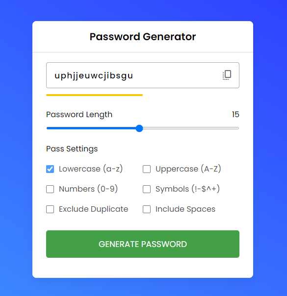

# Password Generator

This is a simple HTML/CSS/JavaScript password generator.

Generate Strong and Secure Passwords with Ease

Keep your online accounts safe and secure with our Password Generator. This simple tool allows you to generate strong and unique passwords that are difficult to crack.

Features:

- Customizable Length: Choose the desired length of your password using the easy-to-use range input.

- Password Settings: Customize your password by selecting or deselecting various options. You can include lowercase and uppercase letters, numbers, symbols, exclude duplicates, and even include spaces.

- Copy to Clipboard: Once you've generated a password that meets your requirements, simply click on the "Copy" icon to easily copy it to your clipboard for immediate use.

Get started now and ensure the security of your online accounts with our Password Generator. Protect your sensitive information and enjoy peace of mind knowing that your passwords are strong and secure.

Try it out today! [here](https://halip26.github.io/password-generator-web/)

## Screenshot

Here we have project screenshot :

### Usage

1. Clone the repository or download the files.
2. Open `index.html` in your web browser.
3. Adjust the password length using the range input.
4. Select or deselect the desired password settings (lowercase, uppercase, numbers, symbols, excluding duplicates, including spaces).
5. Click the "Generate Password" button to generate a new password.
6. The generated password will be displayed in the input box. You can copy it by clicking the "copy_all" icon.

### Technologies Used

- HTML
- CSS
- JavaScript

### Credits

- Font Material Symbols Rounded from [Google Fonts](https://fonts.googleapis.com/css2?family=Material+Symbols+Rounded)
- Password Generator icon from [Flaticon](https://www.flaticon.com/)

### License

This project is licensed under the [MIT License](LICENSE).
